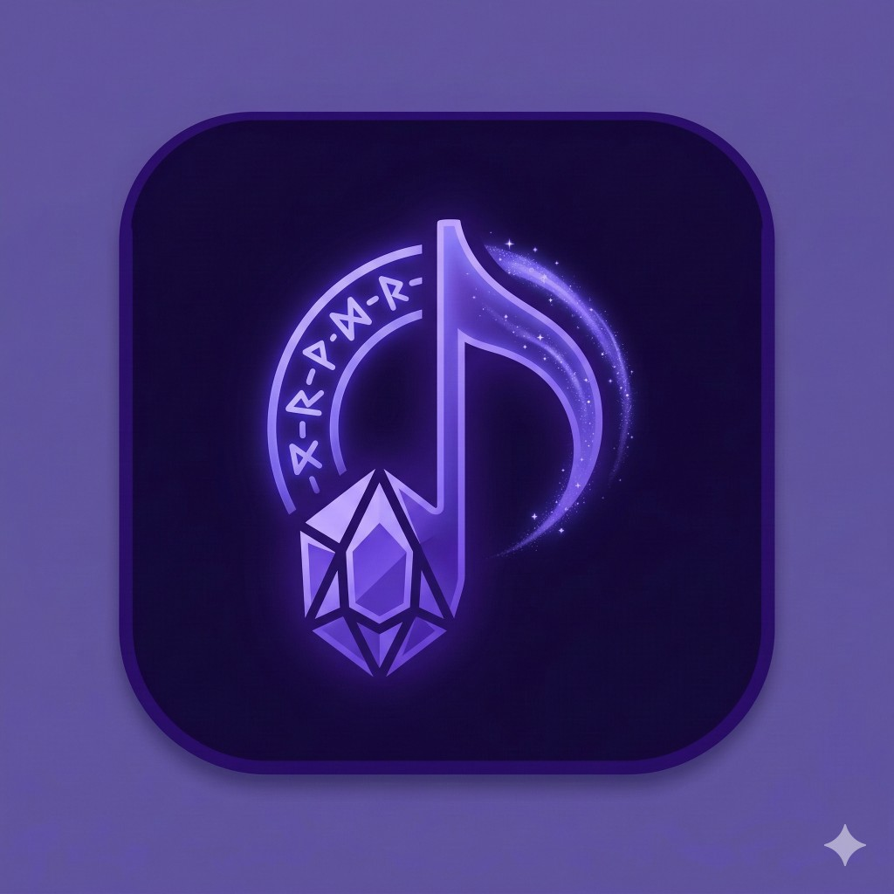

<div align="center">
  
  <h1>BGMancer</h1>
  <p><strong>The AI-powered curator for the ultimate video game music experience.</strong></p>

  
  
  
  

  <br /><br />

  <p>
    BGMancer bridges your game library and the vast world of YouTube OSTs.<br />
    By leveraging local LLMs, it doesn't just find music — it understands <em>vibes</em>.
  </p>

  <p>
    <a href="#-getting-started">Quick Start</a> · 
    <a href="#-key-features">Features</a> · 
    <a href="#-how-it-works">How It Works</a> · 
    <a href="BACKLOG.md">Roadmap</a>
  </p>
</div>

<br />

<!-- 
  TODO: Add a demo GIF or screenshot here.
  A 10-second recording of generating a playlist and the equalizer bars moving 
  will make this repo feel alive.

  <div align="center">
    
  </div>
-->

---

## ✨ Key Features

🎮 **Library-Driven Curation**
Build your mix based on your personal game history. Add games, pick a vibe per game — *Official Soundtrack*, *Boss Themes*, or *Ambient & Exploration* — and BGMancer composes a varied playlist across all of them.

🧠 **Local AI Intelligence**
Uses **Ollama (Llama 3.2)** running entirely on your machine to semantically analyze real YouTube track titles and select the best matches for your chosen vibe. No cloud AI, no API costs, no data leaving your box.

⚡ **Zero-Config Database**
Powered by SQLite — a single file, no Docker, no database server. Clone, install, play.

📺 **Deep YouTube Integration**
Stream directly via the YouTube IFrame API with a full-featured player bar, or sync curated playlists to your YouTube account via Google OAuth. When quota runs out, paste any public playlist URL to import tracks instantly.

🎚️ **Player Built for Deep Work**
Shuffle, volume control, a **Dim toggle** that drops to 20% in one click (stay quiet on calls), Up Next preview, elapsed/duration display, and vibe-coded accent colors per track.

🔄 **Live Generation Pipeline**
Watch your playlist build in real time — a Server-Sent Events progress panel shows per-game status as BGMancer searches YouTube, fetches track lists, and asks the AI to curate.

---

## 🛠️ Tech Stack

| Layer | Technology |
|---|---|
| **Frontend** | Next.js 16 (App Router, Turbopack), React 19, Tailwind CSS 4 |
| **Intelligence** | Ollama running `llama3.2` locally |
| **Backend** | Next.js Route Handlers, Server-Sent Events (SSE) |
| **Storage** | SQLite via `better-sqlite3` (WAL mode, FK constraints) |
| **YouTube** | Data API v3 (search + playlist read) + IFrame Player API |
| **Auth** | NextAuth v5 + Google OAuth (optional — only for playlist sync) |

---

## 🚀 Getting Started

### Prerequisites

| Requirement | How to get it |
|---|---|
| **Node.js** ≥ 18 | [nodejs.org](https://nodejs.org/) |
| **Ollama** | [ollama.com](https://ollama.com/) → then run `ollama pull llama3.2` |
| **YouTube API Key** | [Google Cloud Console](https://console.cloud.google.com/) → APIs & Services → YouTube Data API v3 |

### Installation

```bash
git clone https://github.com/yourusername/bgmancer.git
cd bgmancer
npm install
```

### Environment Setup

```bash
cp .env.local.example .env.local
```

Open `.env.local` and fill in your keys:

```env
# Required
YOUTUBE_API_KEY=your_youtube_api_key

# Optional — only needed for "Sync to YouTube" feature
GOOGLE_CLIENT_ID=your_google_client_id
GOOGLE_CLIENT_SECRET=your_google_client_secret
NEXTAUTH_SECRET=run_openssl_rand_base64_32
```

### Launch

```bash
ollama serve          # start the local AI model
npm run dev           # → http://localhost:6959
```

BGMancer automatically creates a `bgmancer.db` SQLite file in the project root on first boot. No migrations, no setup.

> [!TIP]
> **YouTube quota exhausted?** Paste any public YouTube playlist URL into the import form to load tracks with a single low-cost API call — no search quota needed.

---

## 📖 How It Works

```
┌─────────────┐    ┌──────────────┐    ┌───────────┐    ┌──────────┐
│  Game Library│───▶│  YouTube API │───▶│  Ollama   │───▶│ Playlist │
│  (your games)│    │  (find OSTs) │    │ (pick the │    │ (curated │
│              │    │              │    │  best fit) │    │  tracks) │
└─────────────┘    └──────────────┘    └───────────┘    └──────────┘
```

1. **You add games** and choose a vibe for each
2. **BGMancer searches YouTube** for each game's official OST playlist
3. **The local AI reads real track titles** and picks the ones that match your vibe
4. **Tracks are interleaved** across games so the playlist stays varied
5. **Press play** — or sync to YouTube with one click

The AI never hallucinates tracks. It only selects from real YouTube videos that actually exist.

---

## 📚 Documentation

| Document | Description |
|---|---|
| **[FEATURES.md](FEATURES.md)** | Detailed breakdown of every feature |
| **[BACKLOG.md](BACKLOG.md)** | Roadmap — what's coming next |
| **[LEGAL.md](LEGAL.md)** | Disclaimers and third-party terms |

---

<div align="center">
  <sub>Built for gamers who take their soundtracks seriously.</sub>
</div>
